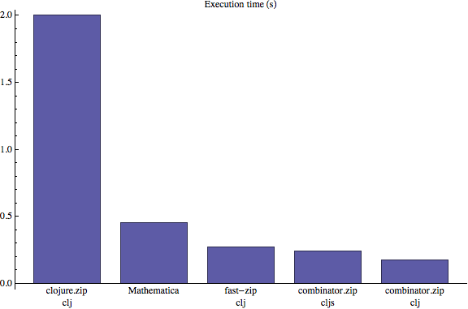
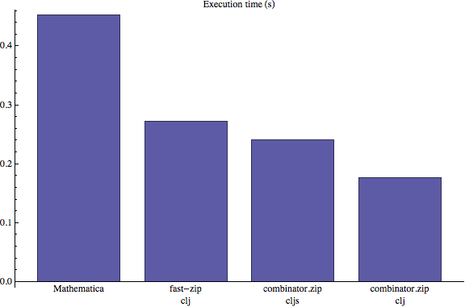

# combinator

This project is an experiment in fast term-rewriting in clojure. Its goal is to establish the upper bound on term-rewriting performance in clojure and clojurescript.


# The combinator system

For our benchmarks, we are using the simple combinator-like systems defined at https://www.wolframscience.com/nksonline/section-3.10 .

These combinators iteratively rewrite a binary tree; each iteration is a pre-order traversal that performs all non-overlapping rewrites.

The nodes in the binary tree consist of either the symbol constant e, or a node with two children that again satisfy the criteria.

In Mathematica notation, these trees are expressed as

```
e        ;; node consistent of single atomic element
e[e]     ;; node consisting of two atomic children 
e[e][e]  ;; depth-3 tree, with e[e] as the left branch, and e as the right branch
```

The combinators themselves are expressed as rules like

```
e[x_][y_]->x[e[y]][x]
```

where x_ and y_ are wildcards that will match any subtree in those positions. 

```
e[e][e]  ;; matches rule
e[e[e]][e] ;; matches rule
e[e][e][e] ;; does not match
```

Different right-hand-sides of the rules will generate different behavior, in terms of the final result, the pattern of recursion, and ultimately patterns of memory access and method invocation.

For the moment we are using only the sample combinator shown above, but a more rigorous test would enumerate all possible combinators up to a certain rhs tree size.

Starting from the initial condition 

```
e[e[e][e]][e][e]
```

the first three steps of evolution are

```
e[e][e][e[e]][e[e][e]][e]
e[e[e]][e][e[e]][e[e[e]][e]][e]
e[e][e[e]][e[e]][e[e]][e[e][e[e]][e[e]]][e]
```

# Representation and implementation in clojure

In general, and for this rule in particular, the evolution will not reach a fixed-point. Therefore we cannot implement the combinator as a naive recursive function because it will never return.   

Furthermore, we cannot use a recursive function like clojure.walk to drive the traversal, because we will quickly blow the stack.

Zippers are the ideal solution, and most of the work in this project is to optimize the zipper implementation.

To represent the binary trees, we use seq'able datastructures.

Thus,

```
e[e[e][e]][e][e]
```

is represented as

```
`(((:e ((:e :e) :e)) :e) :e)
```

To make the combinator rule as fast as possible, encode the rule in a low-level form

```
(defn sample-combinator
  [x]
  (if (seq? x)
    (let [l1 (first x)]
      (if (seq? l1)
        (if (identical? :e  (first l1))
          (let [l1r (second l1)] (list (list l1r (list :e (second x))) l1r)))))))
```

that checks the structure of an input against the desired structure of e[x_][y_] (equivalently, '((:e ?x) ?y)  ), and returns a new tree if it succeeds.


# Performance

We evolve the sample combinator for 300 steps. The system used is a macbook pro with 2.3GHz intil core i7 .

In Mathematica, this is expressed as

```
Nest[# /. e[x_][y_] -> x[e[y]][x] &, e[e[e][e]][e][e], 300]
```

The total evolution involves over 1.4 million operations of (rule attempt + navigate tree). The resulting tree has 10412 nodes, 5207 of which are leaves. The serialized representation has 15619 characters. 

In clojure, we evolve the system with several zipper implementations: clojure.zip, fast-zip, and two versions of the optimized combinator.zip (for clojure and clojurescript)





# Discussion

The performance is excellent. These results show that the Clojure platform is a good substrate for implementing rewriting systems. 

Even just using fast-zip, it is around 2x Mathematica. The optimized implementations are nearly 3x for clojure, and 2x for clojurescript. This is very impressive, considering the equivalent operations in Mathematica are implemented in optimized C code. 

I tried many possible datastructures, but using seqs as the basis for the zipper was by far the fastest.

Additional performance gains were achieved by

- Manual cloning of records, instead of using assoc
- Using custom tuples for the left side of the zipper
- Using deftype instead of defrecord in the clojurescript version
- Optimizations in the boolean logic operations in clojurescript

Further optimizations are possible by taking advantage of traversal strategy, which should only ever call up from the rightmost child.

# Further workd

A macro rule compiler would make it easy to benchmark with different combinator rules with different behavior.

It would be very interested to benchmark this against systems like Maude, Stratego, ASF+SDF, OMeta, and K. Sample code and instructions to this effect is very welcome.


